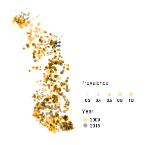

 

Predicting geohelminths infections prevalence

 

## Notes

 

The distribution of hookworm disease examinations sites in Togo.  During the two years in question, the examinations 
predominantly occurred at different sites; only 4 overlap.

 
 

 
 

 
 

 
 
